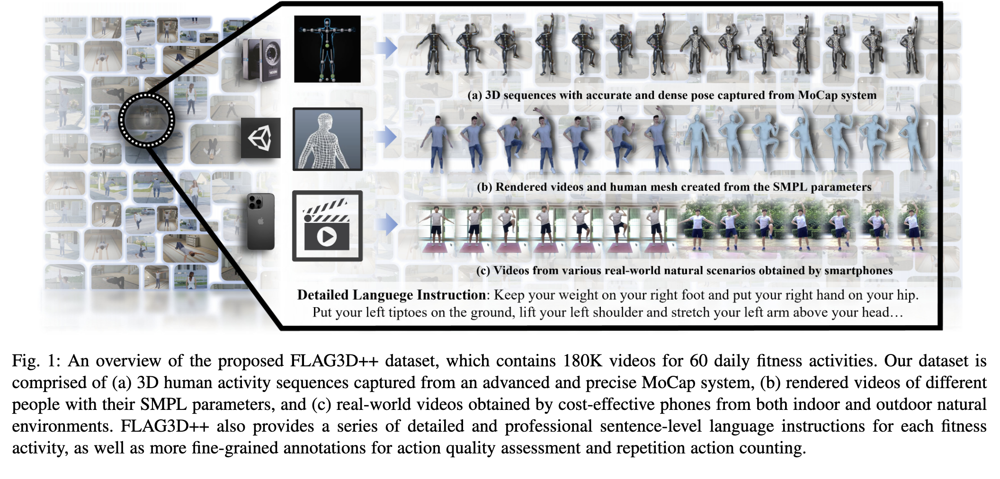
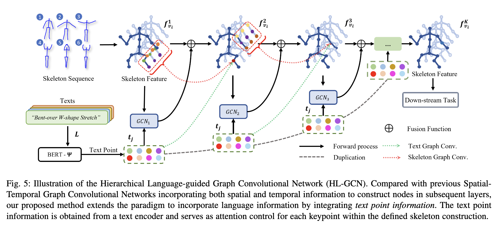
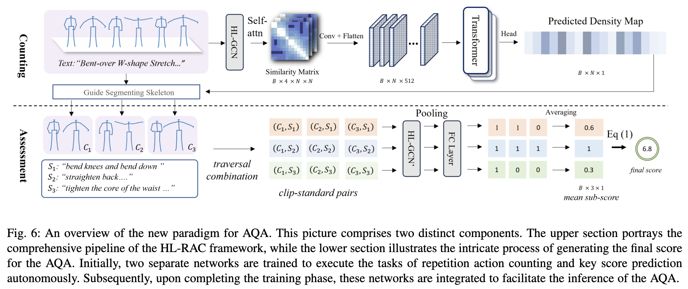

<h1>
  FLAG3D++: A Benchmark for 3D Fitness Activity Comprehension with Language Instruction
</h1>

    <a href="https://andytang15.github.io/">
        Yansong Tang1
    </a>&emsp;
    <!--  Tsinghua University -->
    <a>
        Aoyang Liu1
    </a>&emsp;
    <!--  Tsinghua University -->
    <a href="https://moonsliu.github.io/">
        Jinpeng Liu1
    </a>&emsp;
    <!--  Tsinghua University -->
    <a href="https://shiyi-zh0408.github.io/">
        Shiyi Zhang1
    </a>&emsp;
    <!--  Tsinghua University -->
    <a href="https://github.com/Dai-Wenxun">
        Wenxun Dai1
    </a>&emsp;
    <!--  Tsinghua University -->
    <a href="https://scholar.google.com/citations?user=6a79aPwAAAAJ&hl=en">
        Jie Zhou1
    </a>&emsp;
    <a href="https://scholar.google.com/citations?user=Xrh1OIUAAAAJ&hl=en">
        Xiu Li1
    </a>&emsp;
    <a href="https://scholar.google.com/citations?user=TN8uDQoAAAAJ&hl=zh-CN">
        Jiwen Lu1
    </a>
    <!--  Tsinghua University -->
    </li>&emsp;
     
    1Tsinghua University

<!-- <strong><a href='https://moonsliu.github.io/Pro-Motion/' target='_blank'>Project Page</a></strong>&emsp; -->
<!-- <strong><a href='https://arxiv.org/pdf/2312.14828.pdf'>Paper(arXiv)</a></strong>&emsp; -->

## Updates
- [2024-04] Github Repo Init. Code coming soon! :running::running::running:
